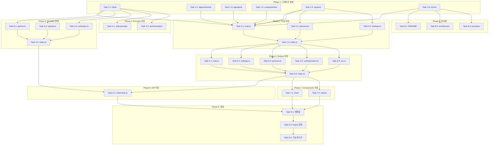

# AI 기능 모듈화 실행 계획

**작성일:** 2026-01-22
**프로젝트:** Habitree Reading Hub v4.0.0
**목적:** Claude Code Subagent를 활용한 일괄 작업 실행

---

## 1. 현재 상태 vs 목표 상태

### 1.1 현재 구조
```
lib/api/
├── gemini.ts          # AI 요약 (Gemini + OpenAI fallback)
├── chat-prompts.ts    # 챗봇 프롬프트
└── ocr.ts             # OCR 처리

app/actions/
├── chat.ts            # 챗 세션/메시지 관리
├── ai-settings.ts     # AI 설정 관리
├── persona.ts         # 페르소나 분석
├── ocr.ts             # OCR 통계/로그
└── books.ts           # getBookDescriptionSummary() 포함

app/api/
└── chat/route.ts      # 챗봇 API (OpenAI/Anthropic/Gemini 호출)

components/
├── chat/              # 챗봇 UI 컴포넌트
└── admin/ai-settings-panel.tsx

types/
├── chat.ts            # 챗 타입
├── persona.ts         # 페르소나 타입
└── ai-settings.ts     # AI 설정 타입
```

### 1.2 목표 구조
```
lib/ai/
├── providers/
│   ├── gemini.ts      # Gemini 클라이언트
│   ├── openai.ts      # OpenAI 클라이언트
│   ├── anthropic.ts   # Anthropic 클라이언트
│   └── index.ts       # 공통 인터페이스
├── prompts/
│   ├── chat-prompts.ts
│   └── summarization-prompts.ts
├── utils/
│   ├── stream-parser.ts
│   └── token-counter.ts
└── index.ts

app/actions/ai/
├── chat.ts
├── settings.ts
├── persona.ts
├── summarization.ts
├── ocr.ts
└── index.ts

app/api/ai/
├── chat/route.ts
└── summarize/route.ts (향후)

components/ai/
├── chat/
│   ├── chat-interface.tsx
│   ├── chat-message.tsx
│   ├── chat-input.tsx
│   └── chat-sidebar.tsx
└── admin/
    └── ai-settings-panel.tsx

types/ai/
├── chat.ts
├── persona.ts
├── settings.ts
├── providers.ts
└── index.ts

doc/ai/
├── README.md
├── architecture.md
└── providers.md
```

---

## 2. Subagent 작업 단위 분리

### Phase 1: 디렉토리 구조 생성 (병렬 실행 가능)

#### Task 1-1: lib/ai 디렉토리 구조 생성
```
작업 내용:
- lib/ai/ 폴더 생성
- lib/ai/providers/ 폴더 생성
- lib/ai/prompts/ 폴더 생성
- lib/ai/utils/ 폴더 생성
- lib/ai/index.ts 생성 (빈 파일 또는 기본 export)

Subagent 명령:
"lib/ai 디렉토리 구조를 생성하세요:
1. lib/ai/providers/ 폴더 생성
2. lib/ai/prompts/ 폴더 생성
3. lib/ai/utils/ 폴더 생성
4. lib/ai/index.ts 파일 생성 (기본 export 주석만 포함)"
```

#### Task 1-2: app/actions/ai 디렉토리 생성
```
작업 내용:
- app/actions/ai/ 폴더 생성
- app/actions/ai/index.ts 생성

Subagent 명령:
"app/actions/ai/ 디렉토리를 생성하고 index.ts 파일을 추가하세요."
```

#### Task 1-3: app/api/ai 디렉토리 생성
```
작업 내용:
- app/api/ai/ 폴더 생성
- app/api/ai/chat/ 폴더 생성

Subagent 명령:
"app/api/ai/chat/ 디렉토리 구조를 생성하세요."
```

#### Task 1-4: components/ai 디렉토리 생성
```
작업 내용:
- components/ai/ 폴더 생성
- components/ai/chat/ 폴더 생성
- components/ai/admin/ 폴더 생성

Subagent 명령:
"components/ai/ 디렉토리 구조를 생성하세요:
1. components/ai/chat/ 폴더
2. components/ai/admin/ 폴더"
```

#### Task 1-5: types/ai 디렉토리 생성
```
작업 내용:
- types/ai/ 폴더 생성
- types/ai/index.ts 생성

Subagent 명령:
"types/ai/ 디렉토리를 생성하고 index.ts 파일을 추가하세요."
```

#### Task 1-6: doc/ai 디렉토리 생성
```
작업 내용:
- doc/ai/ 폴더 생성

Subagent 명령:
"doc/ai/ 디렉토리를 생성하세요."
```

---

### Phase 2: 타입 파일 이동 (순차 실행 권장)

#### Task 2-1: types/ai/chat.ts 생성
```
작업 내용:
- types/chat.ts 내용을 types/ai/chat.ts로 복사
- 기존 파일은 유지 (deprecation 주석 추가)

Subagent 명령:
"types/chat.ts 파일을 types/ai/chat.ts로 복사하세요.
기존 types/chat.ts 파일 상단에 다음 주석을 추가하세요:
// @deprecated 이 파일은 types/ai/chat.ts로 이동되었습니다.
// 하위 호환성을 위해 유지됩니다.
export * from './ai/chat';"
```

#### Task 2-2: types/ai/persona.ts 생성
```
작업 내용:
- types/persona.ts 내용을 types/ai/persona.ts로 복사
- 기존 파일은 유지 (re-export)

Subagent 명령:
"types/persona.ts 파일을 types/ai/persona.ts로 복사하세요.
기존 types/persona.ts는 types/ai/persona.ts를 re-export하도록 수정하세요."
```

#### Task 2-3: types/ai/settings.ts 생성
```
작업 내용:
- types/ai-settings.ts 내용을 types/ai/settings.ts로 복사
- 기존 파일은 유지 (re-export)

Subagent 명령:
"types/ai-settings.ts 파일을 types/ai/settings.ts로 복사하세요.
기존 types/ai-settings.ts는 types/ai/settings.ts를 re-export하도록 수정하세요."
```

#### Task 2-4: types/ai/index.ts 작성
```
작업 내용:
- types/ai/index.ts에 모든 타입 re-export

Subagent 명령:
"types/ai/index.ts 파일을 작성하세요:
export * from './chat';
export * from './persona';
export * from './settings';"
```

---

### Phase 3: lib/ai Provider 분리 (핵심 작업)

#### Task 3-1: lib/ai/providers/gemini.ts 생성
```
작업 내용:
- lib/api/gemini.ts에서 Gemini 관련 코드 추출
- 새 파일에 Gemini 클라이언트와 요약 함수 배치

Subagent 명령:
"lib/api/gemini.ts를 분석하여 lib/ai/providers/gemini.ts를 생성하세요:
1. getGeminiClient() 함수 이동
2. Gemini 관련 타입 정의 추가
3. summarizeWithGemini() 함수 생성 (Gemini 전용)
기존 lib/api/gemini.ts는 수정하지 마세요."
```

#### Task 3-2: lib/ai/providers/openai.ts 생성
```
작업 내용:
- lib/api/gemini.ts와 app/api/chat/route.ts에서 OpenAI 관련 코드 추출
- 새 파일에 OpenAI 클라이언트 배치

Subagent 명령:
"lib/api/gemini.ts와 app/api/chat/route.ts를 분석하여 lib/ai/providers/openai.ts를 생성하세요:
1. getOpenAIClient() 함수 추출
2. callOpenAI() 함수 추출 (route.ts에서)
3. parseOpenAIStream() 함수 추출 (route.ts에서)
4. 타입 정의 추가"
```

#### Task 3-3: lib/ai/providers/anthropic.ts 생성
```
작업 내용:
- app/api/chat/route.ts에서 Anthropic 관련 코드 추출
- 새 파일에 Anthropic 클라이언트 배치

Subagent 명령:
"app/api/chat/route.ts를 분석하여 lib/ai/providers/anthropic.ts를 생성하세요:
1. callAnthropic() 함수 추출
2. parseAnthropicStream() 함수 추출
3. Anthropic 클라이언트 초기화 함수 생성
4. 타입 정의 추가"
```

#### Task 3-4: lib/ai/providers/index.ts 생성
```
작업 내용:
- 공통 Provider 인터페이스 정의
- 모든 provider export

Subagent 명령:
"lib/ai/providers/index.ts를 생성하세요:
1. AIProvider 공통 인터페이스 정의
2. 모든 provider export (gemini, openai, anthropic)
3. getProvider(providerName) 팩토리 함수 생성"
```

---

### Phase 4: lib/ai Prompts 이동

#### Task 4-1: lib/ai/prompts/chat-prompts.ts 생성
```
작업 내용:
- lib/api/chat-prompts.ts 내용을 새 위치로 복사

Subagent 명령:
"lib/api/chat-prompts.ts 파일을 lib/ai/prompts/chat-prompts.ts로 복사하세요.
기존 파일은 새 경로를 re-export하도록 수정하세요."
```

#### Task 4-2: lib/ai/prompts/summarization-prompts.ts 생성
```
작업 내용:
- lib/api/gemini.ts의 프롬프트 텍스트를 별도 파일로 분리

Subagent 명령:
"lib/api/gemini.ts의 summarizeBookDescription() 내 프롬프트를 분석하여
lib/ai/prompts/summarization-prompts.ts 파일을 생성하세요:
1. BOOK_SUMMARY_PROMPT 상수 정의
2. 프롬프트 템플릿 함수 생성"
```

---

### Phase 5: app/actions/ai 이동

#### Task 5-1: app/actions/ai/chat.ts 생성
```
작업 내용:
- app/actions/chat.ts 내용 복사
- import 경로 업데이트

Subagent 명령:
"app/actions/chat.ts 파일을 app/actions/ai/chat.ts로 복사하세요.
import 경로를 새 타입 위치로 업데이트하세요 (@/types/ai/).
기존 파일은 새 경로를 re-export하도록 수정하세요."
```

#### Task 5-2: app/actions/ai/settings.ts 생성
```
작업 내용:
- app/actions/ai-settings.ts 내용 복사
- import 경로 업데이트

Subagent 명령:
"app/actions/ai-settings.ts 파일을 app/actions/ai/settings.ts로 복사하세요.
import 경로를 새 타입 위치로 업데이트하세요.
기존 파일은 새 경로를 re-export하도록 수정하세요."
```

#### Task 5-3: app/actions/ai/persona.ts 생성
```
작업 내용:
- app/actions/persona.ts 내용 복사
- import 경로 업데이트

Subagent 명령:
"app/actions/persona.ts 파일을 app/actions/ai/persona.ts로 복사하세요.
import 경로를 새 타입 위치로 업데이트하세요.
기존 파일은 새 경로를 re-export하도록 수정하세요."
```

#### Task 5-4: app/actions/ai/summarization.ts 생성 (신규)
```
작업 내용:
- app/actions/books.ts의 getBookDescriptionSummary() 추출
- 새 파일로 분리

Subagent 명령:
"app/actions/books.ts에서 getBookDescriptionSummary() 함수와 관련 로직을 추출하여
app/actions/ai/summarization.ts 파일을 생성하세요.
books.ts의 해당 함수는 새 파일을 import하여 re-export하도록 수정하세요."
```

#### Task 5-5: app/actions/ai/ocr.ts 생성
```
작업 내용:
- app/actions/ocr.ts 내용 복사

Subagent 명령:
"app/actions/ocr.ts 파일을 app/actions/ai/ocr.ts로 복사하세요.
기존 파일은 새 경로를 re-export하도록 수정하세요."
```

#### Task 5-6: app/actions/ai/index.ts 작성
```
작업 내용:
- 모든 AI 액션 re-export

Subagent 명령:
"app/actions/ai/index.ts 파일을 작성하세요:
export * from './chat';
export * from './settings';
export * from './persona';
export * from './summarization';
export * from './ocr';"
```

---

### Phase 6: app/api/ai 이동

#### Task 6-1: app/api/ai/chat/route.ts 생성
```
작업 내용:
- app/api/chat/route.ts 내용 복사
- import 경로 업데이트 (lib/ai/providers 사용)
- 인라인 함수를 provider로 대체

Subagent 명령:
"app/api/chat/route.ts를 app/api/ai/chat/route.ts로 복사하세요.
다음 수정 사항을 적용하세요:
1. callOpenAI, callAnthropic 함수를 lib/ai/providers에서 import
2. 스트림 파서를 lib/ai/providers에서 import
3. 타입을 types/ai/에서 import
기존 app/api/chat/route.ts는 새 경로로 redirect하는 코드로 교체하세요."
```

---

### Phase 7: components/ai 이동

#### Task 7-1: components/ai/chat/ 파일들 복사
```
작업 내용:
- components/chat/ 전체를 components/ai/chat/로 복사
- import 경로 업데이트

Subagent 명령:
"components/chat/ 폴더의 모든 파일을 components/ai/chat/로 복사하세요.
각 파일의 import 경로를 업데이트하세요:
- @/types/chat → @/types/ai/chat
- @/app/actions/chat → @/app/actions/ai/chat
기존 components/chat/ 파일들은 새 경로를 re-export하도록 수정하세요."
```

#### Task 7-2: components/ai/admin/ai-settings-panel.tsx 복사
```
작업 내용:
- components/admin/ai-settings-panel.tsx 복사
- import 경로 업데이트

Subagent 명령:
"components/admin/ai-settings-panel.tsx를 components/ai/admin/ai-settings-panel.tsx로 복사하세요.
import 경로를 업데이트하세요.
기존 파일은 새 경로를 re-export하도록 수정하세요."
```

---

### Phase 8: 문서화

#### Task 8-1: doc/ai/README.md 작성
```
Subagent 명령:
"doc/ai/README.md 파일을 작성하세요:
1. AI 기능 개요
2. 디렉토리 구조 설명
3. 빠른 시작 가이드
4. 환경 변수 설정 (GEMINI_API_KEY, OPENAI_API_KEY, ANTHROPIC_API_KEY)"
```

#### Task 8-2: doc/ai/architecture.md 작성
```
Subagent 명령:
"doc/ai/architecture.md 파일을 작성하세요:
1. AI 아키텍처 다이어그램 (Mermaid)
2. 레이어별 역할 설명
3. 데이터 흐름
4. 주요 컴포넌트 설명"
```

#### Task 8-3: doc/ai/providers.md 작성
```
Subagent 명령:
"doc/ai/providers.md 파일을 작성하세요:
1. 지원하는 AI 제공자 (Gemini, OpenAI, Anthropic)
2. 각 제공자별 설정 방법
3. 모델 목록
4. fallback 메커니즘 설명"
```

---

### Phase 9: 검증 및 정리

#### Task 9-1: TypeScript 컴파일 검증
```
Subagent 명령:
"npm run build를 실행하여 TypeScript 컴파일 오류가 없는지 확인하세요.
오류가 있으면 오류 내용을 보고하세요."
```

#### Task 9-2: import 경로 검증
```
Subagent 명령:
"다음 명령을 실행하여 잘못된 import가 없는지 확인하세요:
1. lib/api/gemini.ts가 아닌 lib/ai/providers/gemini.ts를 import하는 파일 검색
2. types/chat.ts가 아닌 types/ai/chat.ts를 import하는 파일 검색
결과를 보고하세요."
```

#### Task 9-3: 기능 테스트 체크리스트
```
Subagent 명령:
"다음 기능들이 정상 동작하는지 테스트 방법을 제시하세요:
1. 채팅 기능 (/chat 페이지)
2. 책 설명 요약 (책 목록 페이지)
3. 페르소나 분석 (/profile 페이지)
4. AI 설정 관리 (/admin/ai-settings 페이지)"
```

---

## 3. 실행 순서 및 의존성



---

## 4. 병렬 실행 그룹

### 그룹 A: Phase 1 (모두 병렬 실행 가능)
- Task 1-1 ~ 1-6 동시 실행

### 그룹 B: Phase 2 + 3 + 4 (부분 병렬)
- Task 2-1, 2-2, 2-3 병렬
- Task 3-1, 3-2, 3-3 병렬
- Task 4-1, 4-2 병렬

### 그룹 C: Phase 5 (부분 병렬)
- Task 5-1, 5-2, 5-3, 5-4, 5-5 병렬
- Task 5-6은 위 작업 완료 후

### 그룹 D: Phase 6 + 7 (순차)
- Task 6-1 먼저
- Task 7-1, 7-2 병렬

### 그룹 E: Phase 8 (병렬)
- Task 8-1, 8-2, 8-3 병렬

### 그룹 F: Phase 9 (순차)
- Task 9-1 → 9-2 → 9-3 순차

---

## 5. 예상 작업량

| Phase | 작업 수 | 예상 난이도 | 예상 소요 |
|-------|--------|------------|----------|
| Phase 1 | 6 | 낮음 | 10분 |
| Phase 2 | 4 | 낮음 | 15분 |
| Phase 3 | 4 | 높음 | 45분 |
| Phase 4 | 2 | 중간 | 15분 |
| Phase 5 | 6 | 중간 | 30분 |
| Phase 6 | 1 | 높음 | 20분 |
| Phase 7 | 2 | 중간 | 20분 |
| Phase 8 | 3 | 낮음 | 20분 |
| Phase 9 | 3 | 중간 | 15분 |
| **합계** | **31** | - | **~3시간** |

---

## 6. 롤백 전략

### 기존 파일 보존
- 모든 기존 파일은 삭제하지 않고 re-export로 유지
- 새 경로가 안정화된 후 deprecation 주석 추가
- 최종 정리는 별도 Phase로 진행

### 롤백 방법
```bash
# git으로 변경 사항 확인
git status
git diff

# 문제 발생 시 롤백
git checkout -- .
```

---

## 7. 검증 체크리스트

### 컴파일 검증
- [ ] `npm run build` 성공
- [ ] TypeScript 오류 없음

### 기능 검증
- [ ] 채팅 기능 정상 동작
- [ ] 책 설명 요약 정상 동작
- [ ] 페르소나 분석 정상 동작
- [ ] AI 설정 관리 정상 동작
- [ ] OCR 기능 정상 동작

### import 검증
- [ ] 순환 의존성 없음
- [ ] 잘못된 경로 없음

---

## 8. 다음 단계

이 계획이 승인되면 다음 순서로 실행합니다:

1. **Phase 1 실행**: 디렉토리 구조 일괄 생성
2. **Phase 2-4 실행**: 타입, Provider, Prompts 이동
3. **Phase 5-7 실행**: Actions, API, Components 이동
4. **Phase 8 실행**: 문서화
5. **Phase 9 실행**: 검증 및 정리
