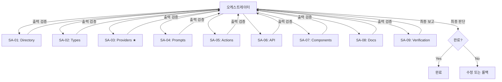

# AI 구조화 Subagent 기반 실행 계획

**작성일:** 2026-01-22
**프로젝트:** Habitree Reading Hub v4.0.0
**설계 원칙:** doc/subagent/subagent.md 기반

---

## 1. 설계 철학

이 계획은 Subagent를 **역할과 책임 중심**으로 설계합니다.

- Subagent는 "똑똑한 AI"가 아니라 **판단 범위가 명확한 역할 모듈**입니다.
- 오케스트레이터는 **의사결정**을, Subagent는 **재료 생성**을 담당합니다.
- 모든 Subagent는 명확한 **입출력 스키마**를 가집니다.

---

## 2. 폴더 구조

```
doc/plan/ai-restructure/
├── README.md                              # 이 파일 (전체 개요)
├── orchestrator.md                        # 오케스트레이터 정의
│
├── subagent-01-directory-setup/
│   └── spec.md                           # 디렉토리 생성 Agent
│
├── subagent-02-type-migration/
│   └── spec.md                           # 타입 이동 Agent
│
├── subagent-03-provider-extraction/
│   └── spec.md                           # Provider 추출 Agent ★핵심
│
├── subagent-04-prompt-migration/
│   └── spec.md                           # Prompts 이동 Agent
│
├── subagent-05-action-migration/
│   └── spec.md                           # Actions 이동 Agent
│
├── subagent-06-api-migration/
│   └── spec.md                           # API 이동 Agent
│
├── subagent-07-component-migration/
│   └── spec.md                           # Components 이동 Agent
│
├── subagent-08-documentation/
│   └── spec.md                           # 문서화 Agent
│
└── subagent-09-verification/
    └── spec.md                           # 검증 Agent
```

---

## 3. 오케스트레이터 vs Subagent

| 구분 | 오케스트레이터 | Subagent |
|------|---------------|----------|
| **역할** | 의사결정, 흐름 제어 | 재료 생성, 작업 실행 |
| **판단** | 합격/불합격 결정 | 결과 보고만 |
| **책임** | 전체 성공/실패 | 개별 작업 완료 |
| **출력** | 최종 결정 | 구조화된 데이터 |

---

## 4. Subagent 목록

| ID | 이름 | 역할 | 판단 범위 |
|----|------|------|----------|
| SA-01 | Directory Setup | 폴더 생성 | 생성 여부만 |
| SA-02 | Type Migration | 타입 이동 | 복사/re-export만 |
| SA-03 | Provider Extraction | Provider 추출 ★ | 함수 추출만 (로직 변경 없음) |
| SA-04 | Prompt Migration | Prompts 이동 | 복사/추출만 |
| SA-05 | Action Migration | Actions 이동 | 복사/import 수정만 |
| SA-06 | API Migration | API 이동 | 복사/import 수정만 |
| SA-07 | Component Migration | Components 이동 | 복사/import 수정만 |
| SA-08 | Documentation | 문서 생성 | 구조화만 |
| SA-09 | Verification | 검증 실행 | 결과 수집만 (판단 없음) |

---

## 5. 실행 순서



---

## 6. 각 Subagent의 입출력 흐름

### SA-01 → SA-02 → SA-03
```
[SA-01]
  입력: 디렉토리 목록
  출력: 생성된 폴더 목록
    ↓
[SA-02]
  입력: 타입 파일 목록
  출력: 이동된 파일, re-export 상태
    ↓
[SA-03]
  입력: 추출 대상 함수
  출력: 생성된 Provider 파일, 컴파일 결과
```

### SA-04 → SA-05 → SA-06 → SA-07
```
[SA-04]
  입력: Prompt 파일 목록
  출력: 이동된 파일
    ↓
[SA-05]
  입력: Action 파일 목록
  출력: 이동된 파일, import 수정 수
    ↓
[SA-06]
  입력: API 파일
  출력: 이동된 파일, Provider import 상태
    ↓
[SA-07]
  입력: Component 목록
  출력: 이동된 파일
```

### SA-08 → SA-09
```
[SA-08]
  입력: 문서 템플릿
  출력: 생성된 문서 목록
    ↓
[SA-09]
  입력: 검증 항목
  출력: 검증 결과 보고서, 권장 조치
```

---

## 7. 불확실성 처리

모든 Subagent는 불확실성을 **구조화된 형태**로 보고합니다:

```typescript
uncertainty: {
  level: "LOW" | "MEDIUM" | "HIGH";
  type?: "INSUFFICIENT_INFO" | "CONFLICTING_SIGNALS" | "OUT_OF_SCOPE";
  message?: string;
}
```

### 불확실성 레벨별 처리

| 레벨 | 의미 | 오케스트레이터 처리 |
|------|------|-------------------|
| LOW | 정상 완료 | 다음 단계 진행 |
| MEDIUM | 일부 문제 | 판단 후 진행/수정 |
| HIGH | 심각한 문제 | 에스컬레이션 또는 롤백 |

---

## 8. 에스컬레이션 경로

```
Subagent → 오케스트레이터 → 사용자
```

에스컬레이션 발생 시 Subagent는:
1. 문제 상황 명확히 기술
2. 시도한 내용 보고
3. 가능한 선택지 제시 (판단은 하지 않음)

---

## 9. 실행 방법

### Claude Code에서 실행

1. **오케스트레이터 시작**
   ```
   "AI 구조화 작업을 시작합니다. SA-01부터 순차적으로 실행하겠습니다."
   ```

2. **Subagent 실행 (각 단계)**
   ```
   "SA-01 Directory Setup Agent를 실행하세요.
    doc/plan/ai-restructure/subagent-01-directory-setup/spec.md의
    실행 명령을 따르세요."
   ```

3. **출력 검증**
   ```
   "SA-01 출력을 확인합니다.
    status: SUCCESS, uncertainty: LOW이므로 다음 단계로 진행합니다."
   ```

4. **반복** (SA-02 ~ SA-09)

5. **최종 판단**
   ```
   "SA-09 검증 결과:
    - buildResult: SUCCESS
    - structureResult: OK
    - importResult: 0 issues
    → 작업 완료로 판단합니다."
   ```

---

## 10. 롤백

문제 발생 시 롤백:

```bash
# 모든 변경 취소
git checkout -- .

# 새로 생성된 폴더 삭제
rm -rf lib/ai app/actions/ai app/api/ai components/ai types/ai doc/ai
```

---

## 11. 예상 소요 시간

| Phase | Subagent | 예상 시간 |
|-------|----------|----------|
| 1 | SA-01 | 2분 |
| 2 | SA-02 | 5분 |
| 3 | SA-03 ★ | 15분 |
| 4 | SA-04 | 5분 |
| 5 | SA-05 | 10분 |
| 6 | SA-06 | 10분 |
| 7 | SA-07 | 10분 |
| 8 | SA-08 | 10분 |
| 9 | SA-09 | 10분 |
| **합계** | - | **~1시간 15분** |

---

## 12. 참조 문서

- [오케스트레이터 정의](./orchestrator.md)
- [SA-01 Directory Setup](./subagent-01-directory-setup/spec.md)
- [SA-02 Type Migration](./subagent-02-type-migration/spec.md)
- [SA-03 Provider Extraction](./subagent-03-provider-extraction/spec.md) ★핵심
- [SA-04 Prompt Migration](./subagent-04-prompt-migration/spec.md)
- [SA-05 Action Migration](./subagent-05-action-migration/spec.md)
- [SA-06 API Migration](./subagent-06-api-migration/spec.md)
- [SA-07 Component Migration](./subagent-07-component-migration/spec.md)
- [SA-08 Documentation](./subagent-08-documentation/spec.md)
- [SA-09 Verification](./subagent-09-verification/spec.md)
- [Subagent 설계 원칙](../../subagent/subagent.md)
