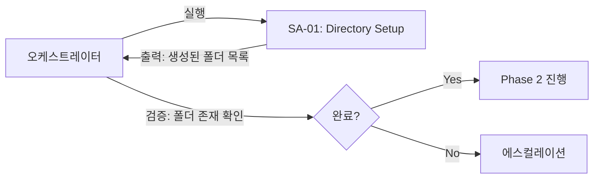
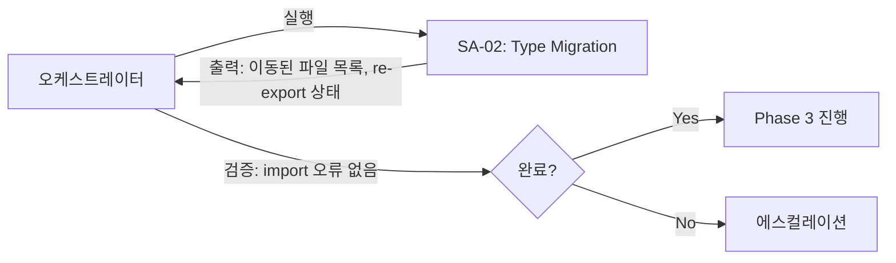
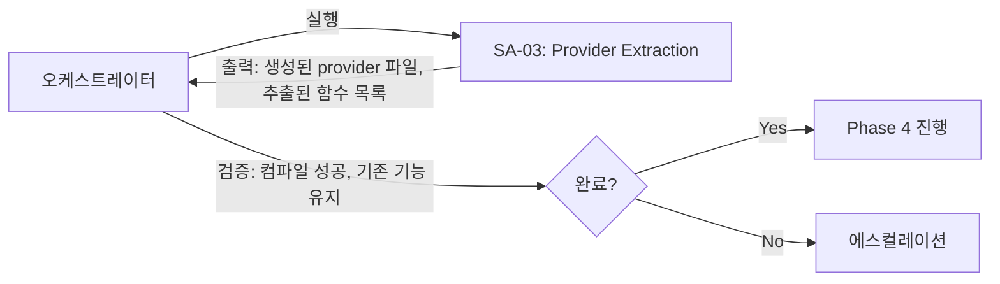
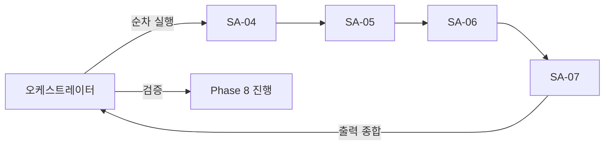
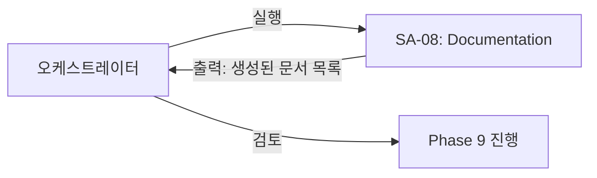
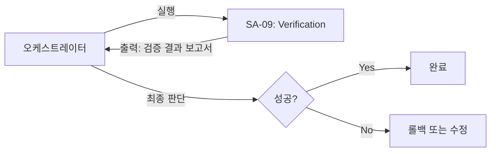

# AI 구조화 오케스트레이터

## 1. 오케스트레이터 역할

오케스트레이터는 **AI 구조화 작업의 전체 흐름을 제어**하는 의사결정 주체이다.

### 핵심 책임
1. Subagent 실행 순서 결정
2. Subagent 출력 검증 및 다음 단계 진행 판단
3. 에스컬레이션 처리 (불확실성 해소)
4. 최종 완료 판단

### 절대 하지 않는 것
- 코드 직접 작성/수정
- 파일 직접 이동/복사
- 세부 구현 판단

> 오케스트레이터는 "무엇을 할지" 결정하고,
> Subagent는 "어떻게 할지" 실행한다.

---

## 2. Subagent 구성

```
┌─────────────────────────────────────────────────────────────┐
│                     ORCHESTRATOR                             │
│  (의사결정, 흐름 제어, 에스컬레이션 처리)                     │
└─────────────────────────────────────────────────────────────┘
        │
        ├──→ [SA-01] Directory Setup Agent
        │         │
        │         ▼
        ├──→ [SA-02] Type Migration Agent
        │         │
        │         ▼
        ├──→ [SA-03] Provider Extraction Agent ★핵심
        │         │
        │         ▼
        ├──→ [SA-04] Prompt Migration Agent
        │         │
        │         ▼
        ├──→ [SA-05] Action Migration Agent
        │         │
        │         ▼
        ├──→ [SA-06] API Migration Agent
        │         │
        │         ▼
        ├──→ [SA-07] Component Migration Agent
        │         │
        │         ▼
        ├──→ [SA-08] Documentation Agent
        │         │
        │         ▼
        └──→ [SA-09] Verification Agent
                  │
                  ▼
              [완료 판단]
```

---

## 3. 실행 흐름

### Phase 1: 준비 (SA-01)


### Phase 2: 타입 이동 (SA-02)


### Phase 3: Provider 추출 (SA-03) ★핵심


### Phase 4-7: 이동 작업 (SA-04 ~ SA-07)


### Phase 8: 문서화 (SA-08)


### Phase 9: 검증 (SA-09)


---

## 4. 의사결정 기준

### 4.1 다음 단계 진행 기준

| 조건 | 판단 |
|------|------|
| Subagent 출력이 예상 스키마와 일치 | 진행 |
| 불확실성 라벨이 "LOW" | 진행 |
| 불확실성 라벨이 "MEDIUM" | 판단 필요 |
| 불확실성 라벨이 "HIGH" | 에스컬레이션 |
| 출력 누락 | 재실행 |

### 4.2 에스컬레이션 처리

```
에스컬레이션 발생 시:
1. Subagent가 보고한 불확실성 유형 확인
2. 필요한 추가 정보 수집
3. 판단 후 재실행 또는 우회

에스컬레이션 유형:
- INSUFFICIENT_INFO: 추가 정보 수집 후 재실행
- CONFLICTING_SIGNALS: 우선순위 결정 후 재실행
- OUT_OF_SCOPE: 사용자에게 문의
```

### 4.3 롤백 결정

```
롤백 조건:
- SA-09 검증 실패 (빌드 오류)
- 기존 기능 동작 불가
- 사용자 요청

롤백 명령:
git checkout -- .
rm -rf lib/ai app/actions/ai app/api/ai components/ai types/ai doc/ai
```

---

## 5. 오케스트레이터 실행 스크립트

### 전체 흐름 (Claude Code에서 실행)

```
1. "SA-01 Directory Setup Agent를 실행하세요"
   → 출력 확인 → 폴더 존재 검증

2. "SA-02 Type Migration Agent를 실행하세요"
   → 출력 확인 → import 오류 검증

3. "SA-03 Provider Extraction Agent를 실행하세요"
   → 출력 확인 → 컴파일 검증

4. "SA-04 Prompt Migration Agent를 실행하세요"
   → 출력 확인

5. "SA-05 Action Migration Agent를 실행하세요"
   → 출력 확인

6. "SA-06 API Migration Agent를 실행하세요"
   → 출력 확인

7. "SA-07 Component Migration Agent를 실행하세요"
   → 출력 확인

8. "SA-08 Documentation Agent를 실행하세요"
   → 출력 확인

9. "SA-09 Verification Agent를 실행하세요"
   → 최종 판단
```

---

## 6. 상태 추적

### 실행 상태 테이블

| Subagent | 상태 | 출력 확인 | 불확실성 | 비고 |
|----------|------|----------|----------|------|
| SA-01 | PENDING | - | - | - |
| SA-02 | PENDING | - | - | - |
| SA-03 | PENDING | - | - | - |
| SA-04 | PENDING | - | - | - |
| SA-05 | PENDING | - | - | - |
| SA-06 | PENDING | - | - | - |
| SA-07 | PENDING | - | - | - |
| SA-08 | PENDING | - | - | - |
| SA-09 | PENDING | - | - | - |

### 상태 값
- `PENDING`: 대기 중
- `RUNNING`: 실행 중
- `COMPLETED`: 완료
- `ESCALATED`: 에스컬레이션 발생
- `FAILED`: 실패
- `SKIPPED`: 건너뜀

---

## 7. 완료 기준

### 전체 작업 완료 조건
1. 모든 Subagent가 COMPLETED 상태
2. SA-09의 검증 결과가 "PASS"
3. `npm run build` 성공
4. 기존 기능 동작 확인

### 부분 완료 허용 조건
- SA-08 (문서화)는 기능에 영향 없으므로 PENDING 허용
- 불확실성 MEDIUM 이하는 진행 허용
