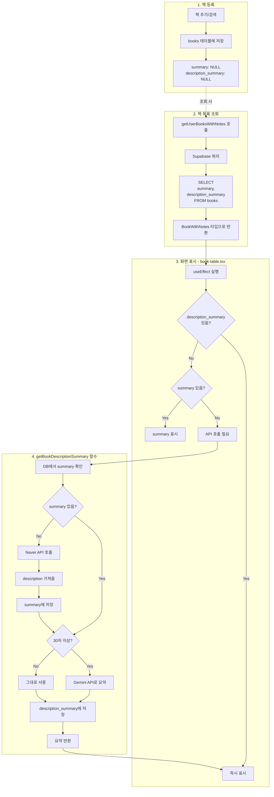
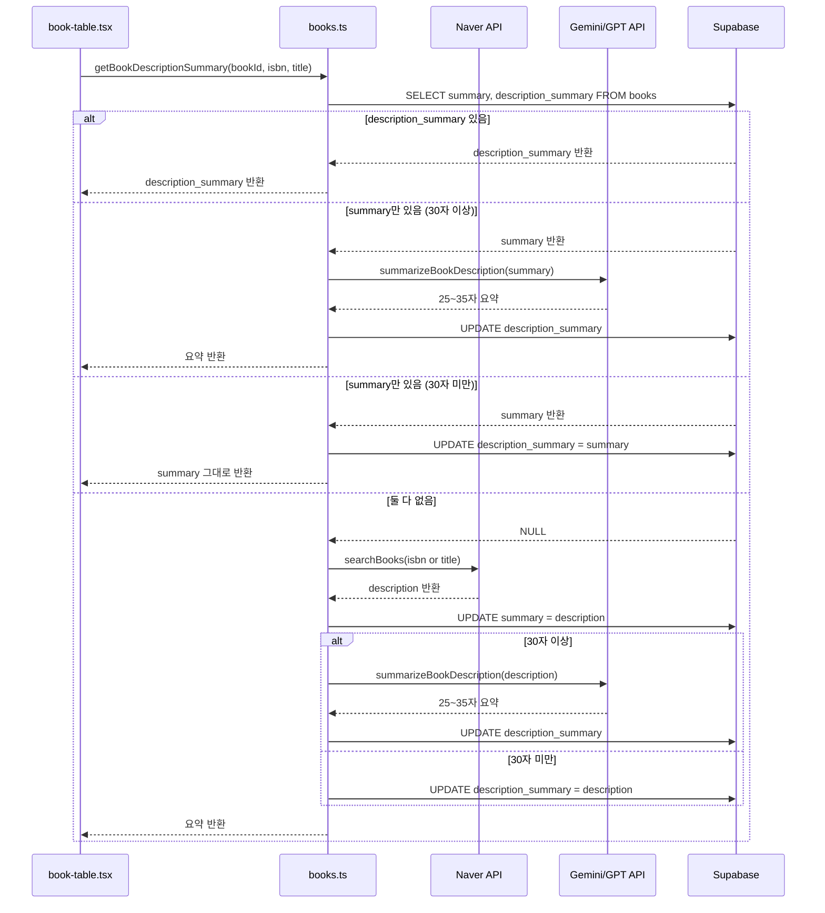
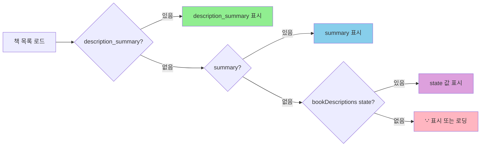
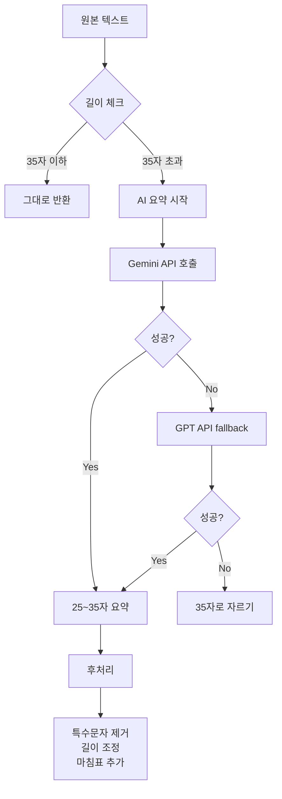
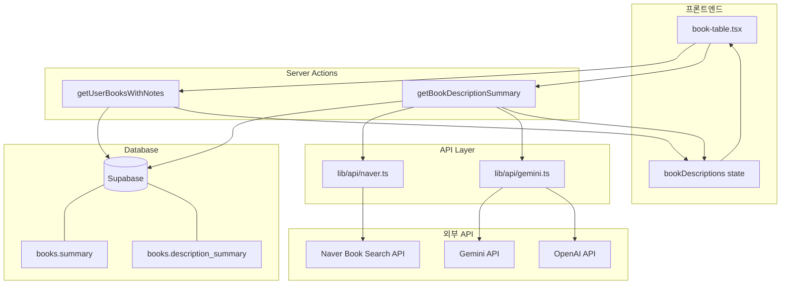

# summary와 description_summary 처리 방식 분석

**작성일:** 2026-01-22
**프로젝트:** Habitree Reading Hub v4.0.0

---

## 1. 데이터베이스 컬럼 정의

### books 테이블

| 컬럼명 | 타입 | 설명 | 용도 |
|--------|------|------|------|
| `summary` | TEXT | 전체 책소개 | Naver API 원본 또는 출판사 제공 |
| `description_summary` | VARCHAR(50) | 25~35자 요약 | Gemini/GPT API로 요약된 짧은 설명 |

---

## 2. 컬럼별 역할

### summary (전체 책소개)
```
- 출처: Naver API의 description 필드
- 길이: 제한 없음 (TEXT)
- 생성: getBookDescriptionSummary() 함수에서 Naver API 호출 시 저장
- 용도: 원본 책소개 보관, 상세 페이지에서 사용 가능
```

### description_summary (요약)
```
- 출처: Gemini/GPT API로 summary를 요약
- 길이: 25~35자 (VARCHAR 50)
- 생성 조건:
  - summary가 30자 이상 → Gemini API로 요약
  - summary가 30자 미만 → 그대로 사용
- 용도: 책 목록 테이블에서 간결한 설명 표시
```

---

## 3. 전체 처리 흐름도



---

## 4. 상세 흐름 다이어그램

### 4.1 데이터 저장 흐름



### 4.2 화면 표시 우선순위



---

## 5. 코드 위치 및 역할

### 5.1 타입 정의

**파일:** `types/database.ts:55-56`

```typescript
books: {
  summary: string | null;           // 전체 책소개
  description_summary: string | null; // 25~35자 요약
}
```

### 5.2 데이터 조회

**파일:** `app/actions/books.ts:722-747`

```typescript
// getUserBooksWithNotes()에서 조회
.select(`
  books (
    description_summary,  // ✅ 조회
    summary,              // ✅ 조회
    ...
  )
`)
```

### 5.3 데이터 생성 및 저장

**파일:** `app/actions/books.ts:1134-1263`

```typescript
// getBookDescriptionSummary()
export async function getBookDescriptionSummary(
  bookId: string,
  isbn?: string | null,
  title?: string | null
): Promise<string>
```

### 5.4 요약 생성 (AI API)

**파일:** `lib/api/gemini.ts:41-189`

```typescript
// summarizeBookDescription()
// - Gemini API 우선 사용
// - 실패 시 GPT API로 fallback
// - 둘 다 실패 시 35자로 자르기
```

### 5.5 화면 표시

**파일:** `components/books/book-table.tsx:111-187, 439-464`

```typescript
// useEffect에서 초기화
if (book.description_summary) {
  initialDescriptions[book.id] = book.description_summary;
} else if (book.summary) {
  initialDescriptions[book.id] = book.summary;
}

// 표시 로직
{book.description_summary || book.summary || bookDescriptions[book.id]}
```

---

## 6. 처리 조건 정리

### 6.1 요약 생성 조건



### 6.2 표시 우선순위

| 순위 | 조건 | 데이터 소스 |
|------|------|-------------|
| 1 | description_summary 존재 | DB (description_summary) |
| 2 | summary 존재 | DB (summary) |
| 3 | state에 캐시됨 | bookDescriptions state |
| 4 | 로딩 중 | "요약 중..." 표시 |
| 5 | 없음 | "-" 표시 |

---

## 7. 아키텍처 다이어그램



---

## 8. 샘플 데이터 처리

### 8.1 샘플 사용자 데이터

**파일:** `app/actions/sample.ts:62-281`

```typescript
// getSampleBooksWithNotes()에서도 동일하게 조회
.select(`
  books (
    description_summary,
    summary,
    ...
  )
`)
```

---

## 9. 정리

### summary vs description_summary

| 항목 | summary | description_summary |
|------|---------|---------------------|
| 길이 | 제한 없음 | 25~35자 |
| 출처 | Naver API 원본 | AI 요약 |
| 생성 시점 | API 호출 시 | API 호출 후 즉시 |
| 사용 위치 | 백업/상세 | 목록 테이블 |
| 우선순위 | 2순위 | 1순위 |

### 핵심 포인트

1. **description_summary 우선**: 화면에는 description_summary를 먼저 표시
2. **Lazy Loading**: 없을 때만 API 호출하여 생성
3. **캐싱**: DB에 저장하여 재사용
4. **Fallback**: Gemini → GPT → 35자 자르기
5. **PC 전용**: 책소개 로드는 PC(lg 이상)에서만 실행

---

## 10. 관련 파일

| 파일 | 역할 |
|------|------|
| `types/database.ts` | 타입 정의 |
| `app/actions/books.ts` | 데이터 조회/저장 |
| `app/actions/sample.ts` | 샘플 데이터 처리 |
| `lib/api/gemini.ts` | AI 요약 생성 |
| `lib/api/naver.ts` | 책 정보 조회 |
| `components/books/book-table.tsx` | 화면 표시 |
| `doc/database/migration-202601151300__books__add_description_summary.sql` | DB 마이그레이션 |
