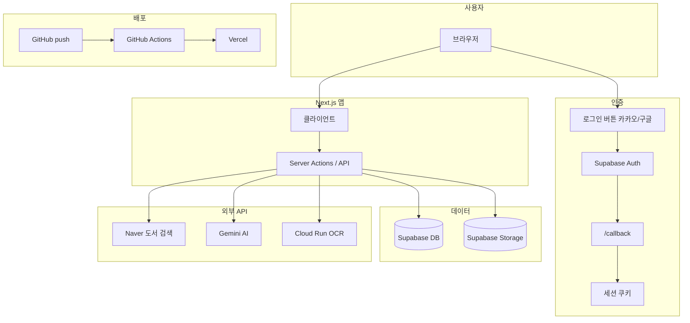

# 연결 정보 (Connect)

**목적**: 현재 프로젝트의 모든 연결(로그인·데이터·API·배포·OCR) 구성을 한곳에서 정리합니다.  
**용도**: 연결 상태 확인, 계정/키/도메인 변경 시 어떤 설정을 어디서 바꿀지 빠르게 참고.

- **연결 설정 전체 흐름**: 인증(Supabase Auth·OAuth) → 데이터(Supabase DB/Storage) → 외부 API(Naver·Gemini·OCR) → 배포(Vercel·GitHub Actions). 각 단계별 상세는 아래 문서 목차를 참고하세요.
- **도메인/프로젝트 변경 시**: 앱 기준 URL이 `lib/utils/url.ts`에 이전 도메인으로 하드코딩된 fallback이 있어, 환경 변수를 설정하지 않으면 로그인 후 이전 도메인으로 리다이렉트될 수 있습니다. 반드시 [주의사항.md](주의사항.md)를 확인하고, Vercel·Supabase·OAuth 설정을 새 도메인에 맞춰 주세요.

---

## 연결 구조 개요

---

## 문서 목차

| 문서 | 설명 |
|------|------|
| [01-auth.md](01-auth.md) | 로그인·인증: Supabase Auth, 카카오/구글 OAuth, 설정 위치와 변수, 흐름 |
| [02-data-supabase.md](02-data-supabase.md) | 데이터: Supabase URL/Anon/Service Role, 사용처, 설정 위치 |
| [03-apis.md](03-apis.md) | 외부 API: Naver, Kakao SDK, 도서 API, Gemini, OCR(Cloud Run) |
| [04-deployment-vercel.md](04-deployment-vercel.md) | 배포: Vercel, GitHub Actions, Secrets |
| [05-env-variables.md](05-env-variables.md) | 환경 변수 일람표: 이름·용도·필수/선택·로컬/Vercel/GitHub |
| [06-check-and-change.md](06-check-and-change.md) | 연결 확인 및 계정/설정 변경 시 체크리스트 |
| [주의사항.md](주의사항.md) | **앱 URL 하드코딩**: `lib/utils/url.ts` 이전 도메인 fallback 위치·확인 방법·도메인 변경 시 조치 |

---

## 관련 문서

- 카카오 앱 키 상세: [doc/question/authentication/kakao-app-key-guide.md](../question/authentication/kakao-app-key-guide.md)
- Vercel 배포 가이드: [doc/setup/vercel-deployment-guide.md](../setup/vercel-deployment-guide.md)
- GitHub Actions 워크플로우: [.github/workflows/README.md](../../.github/workflows/README.md)
